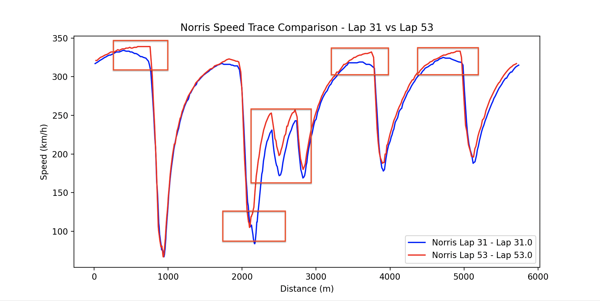
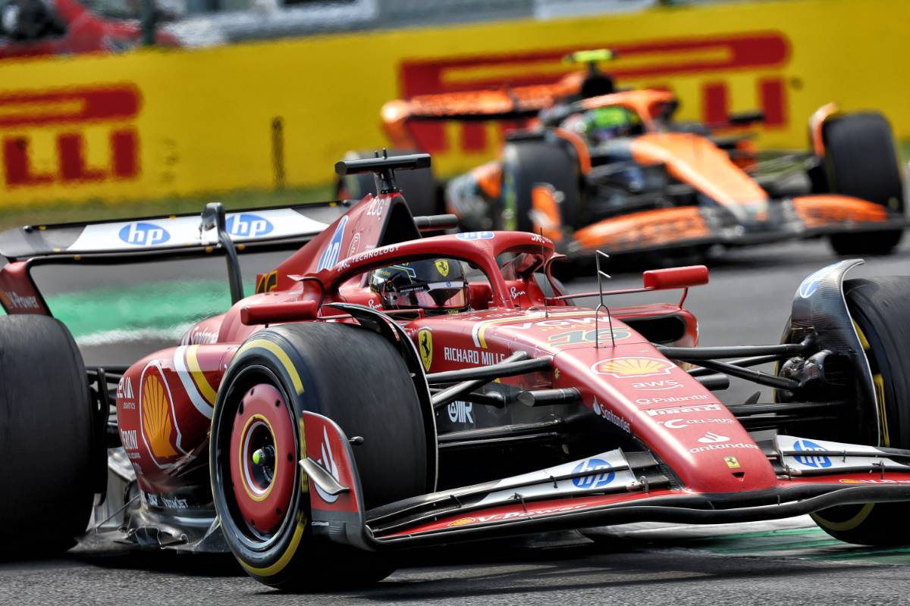

One-Stop VS Two-Stop Strategy

*Table of Contents:*

1. Introduction
2. Race Strategy Breakdown
    - Pit Summary
    - Tire Strategy
3. Telemetry & Lap Time Analysis
4. Tire Management & Degredation
5. Aerodynamic Upgrades & Impact On Performance
6. Building An AI For 
7. Findings & Conclusion
8. References

**1. Introduction**

At the **2024 Italian Grand Prix**, Ferrari and McClaren took two different approaches:
    - Ferrari opted for a one-stop strategy, maximizing track position at the expense of staying on older tires.
    - McClaren opted for a two-stop strategy, prioritizing racing pace at the expense of pitting an additional time.

What this project analyses:
- Which strategy was more effective and why
- Telemetry differences between Leclerc and Norris
- How tire degredation and car upgrades influenced the race outcome

Charles Leclerc went on to win the 2024  Italian Grand Prix, deploying Ferrari's one-stop strategy while Lando Norris finished P3, behind his teammate Oscar Piastri. This projects aims to reveal smaller details that contributed to Leclerc coming out on top despite Lando Norris having solid qualfying pace.

**2. Race Strategy Breakdown**

| Team       | Driver  | Strategy  | Pit Stops | Tire Compounds Used |
|------------|--------|------------|------------|---------------------|
| **Ferrari**| Leclerc|  **One-Stop**|  1  |     Medium → Hard |
| **McLaren**| Norris |  **Two-Stop**|  2  |     Medium → Hard → Soft |

Before analyzing the differing strategies it is important to state the pros and cons of each.

*One-Stop*
Pros: 
- Improve track position later in a stint. By pitting once, a team plays the long game of staying out on track when teams decide to pit later. This is ultimately in hopes of maintaining track position long enough until the ending stages of the race.

Cons:
- By only pitting once, it typically involves a compromise in racing pace. While it is benefitional to have stayed on track longer, for position, it requires less agressive driving to preserve the life of the tires. In the end, if executed poorly, the depleted tires could result in a loss of track position by cars with fresher tires.

*Two-Stop*
Pros:
- An imporovement in racing pace, allowing the driver to driver with a more aggressive style to maximize the life of the tires.

Cons:
- A potential loss in track position due to the extra pit. 

The circuit at Monza has a reputation of being a high-degreation circuit, but due to the low drag setups and high speeds, degredation is minimized. However, this is simply in theory. The reality is there are hundreds of variables that dictate what makes a one-stop or two-stop strategy succeed. 

McClaren did well in qualifying, capturing front row spots on the grid at P1 and P2. Ferrari was not far behind with Leclerc starting P4 and Sainz starting P5. With McClaren showcasing good pace in qualifying, fans and analysts were eager to see if they were able to sustain such pace over the course of the grand prix. Charles Leclerc would go on to win the Italian Grand Prix by executing a risky one-stop strategy. With exceptional tire management, pace and executing by the pit crew, He was able to finish ahead of both McLarens, winning Ferrari's home race.

**3. Lap Time & Telemetry Analysis**

In a post-race interview, Lando Norris stated, "Today we thought of the one-stop. We were ready to try and do a one-stop, we just couldn't achieve it. Our degradation  was too high from the front tires." Therefore, going into the race, the McClaren F1 team was aware that they would most likely need to execute a two-stop strategy and acted accordingly. Throughout 2024, McLaren struggled with front tire degredation, which is particularly more detrimental at a circuit such as Monza. Due to Monza having high-speed braking zones, coming out of long straights, more load is placed on the front tires as the car enters and exits the corner. Over the course of the race this means the driver is not able to brake as aggressively into corners, causing slower lap times in concurrence with futher degraded tires. McLaren's two-stop strategy ultimately resulted in Norris compromising his track position. Below is a graph of Lando's lap times over the race. The spikes in indicate a lap where the driver entered the pit lane, hence the much longer lap time:

As seen in the plot, Norris entered the pit lane on laps 14 and 32.

On the other hand Ferrari's plan was daring, given the conditions. As mentioned before, the risk of tire degredation and drop in performance was a very real threat when executing a one-stop strategy. Concurrently, in the event one finds themselves with good track position, they run the risk of needing to defend their position on worn tires which is an extremely difficult task. Charles Leclerc in a post-race interview made it clear that Ferrari was not entirely confident in the one-stop strategy in the beginning stages of the race after hearing that Red Bull was experiencing graining on the hard tire compound. However Leclerc had a gut feeling that it was the right play, "However, when I  put it on I had quite a good feeling. I just  wanted to put Lando under pressure and he pitted in front of me. Then I managed to get back some front  grip whenever he was out the way." Below is a graph of Leclerc's lap times through the entire race, once again with spikes indicating when he entered the pits:

As seen here, Leclerc pitted once on lap 15. It was highlighted above that Leclerc "pressured" Norris into pitting. On lap 14 (when Norris pitted), Leclerc was in P2 and Norris was in P3 by a gap of ~0.87 to ~0.95 seconds. This was confirmed and cross validated from the official broadcast of the race and summing data from the FastF1 API: 

IMPORTANT CLARIFICATION: 

1. The difference in the intervals can be attributed to the moment at which they were captured. In the photo of Norris entering the pit lane, it shows the last public broadcast interval before a graphical overlay stating "In Pits." Since he is aggressively applying the brakes his interval would be slightly more by time he reaches the white line of the pit lane (which is ~2 meters away. Keep in mind that Leclerc stayed out so he is maintaining full racing pace.

2. The photo from the broadcast says lap 15 despite Norris pitting on his 14th lap. This is because the official lap count is dictated by where the leader is. In the photo we can see that Piastri is in the lead, who is ~4.2 seconds ahead of Norris. This means Piastri has officially began his 15th lap, however Norris is still on his 14th lap until he crosses the starting line (even in the pits).

This <1 second interval is crucial to note due to the fact Norris is inside the "undercut window." Undercutting is a method of overtaking a car by pitting earlier than them to equip fresher, faster tyres. Once new tyres are applied, the driver attempts a fast out lap with the intention of overtaking the leading car when they eventually pit. As one would imagine, the likelyhood of achieving an undercu increases the closer one gets to the car in front. At this particular ciruit, the undercut window is about seconds to 2.5 seconds at most. Therefore, attempting an undercut outside of this range will more than likely fail. In this case, McClaren had Norris pit in an effort to undercut Leclerc, as said by his racing engineer. 

Based on lap time data, Norris began experiencing the effects of tire degredation from laps 10 to 13 before pitting. Below is a plot of Lando's lap times from the beginning of the race up until the lap before his first pit. There is an upward trend starting at lap 10 which indicates a drop off in tire performance.

It is clear that Norris was not going to be able to traditionally overtake Leclerc on his current set of tires. Therefore, the team opted to undercut after seeing slower lap times.

Leclerc would pit on lap 15, equipping hard compound tyres to begin his long stint to the end of the race. However, the undercut move worked on Leclerc for the time being, with Norris taking P6 and Leclerc P7. It's from this point forward where the one-stop strategy proved effective against the two-stop strategy. 

On lap 31, Leclerc's racing engineer, Bryan Bozzi, informs him "Norris starting to struggle, this is when Red Bull started to have graining, around lap 15 of the stint." He is referring to Red Bull initiating the race on hard tire compounds and experiencing degredation around their 15th lap of the stint. Concurrently, Norris would lose grip at the second chicane, which is a high-speed braking zone. Below is a plot of his telemetry on lap 31 (when he started to struggle) and lap 53 (his fastest lap of the race). The areas enclosed in the red boxes indicate portions of the lap where he lost significant performance, particularly descelerating in and accelerating out of corners.

As seen in the telemetry trace, Norris struggled entry and exist of the corners. At the peaks of the telemetry trace, he was braking sooner (blue) and entering the corner slower which is a sign of less grip. Compare this to his fastest lap (red) where he was braking later and carrying more speed into the corners. This is resembled by the sharp dip in the trace compared to the smooth, parabolic trace. The image below is a diagram of the the circuit, highlighting the specific corner where he couldn't make the chicane due to the lack of grip.

Having lost stability from the worn tyres, Norris came to the pits on lap 33 for a fresh set of hards. On lap 39, Lclerc would take the lead of the grand prix while McClaren pitted their other driver, Piastri, who was also on a two-stop strategy.

Now it is time to take a look at Leclerc and how his lap paced held up during this long stint on the hard tyres. Below is a telemtry trace of Leclerc, on lap 39, after retaking the lead compared to his fastest lap of the race. It is incredibly impressive to see the pace he was able to maintain while managing worn tires. At this point in the stint, he was past the point where Ferrari noticed Red Bull's hard compound degrading. However, Leclerc showed minimal signs of degredation which is a main proponent to him maintaining pace. There are corners where Leclerc accelerated out quicker than his fastest lap of the race. This is truly a testiment to Leclerc's skill as a driver but also warrants analysis into other reasons as to why he was able to do this:

Leclerc would go on to maintain his lead on the hard tyre compound and win the Italian Grand Prix. The one-stop strategy at Monza was very risky, requiring surgical precision by the driver executing the stints, and the engineers properly tuning the car for the circuit. 

Taking a look at both Leclerc and Norris on lap 32 (just before Norris Pitted), we can see the result of Leclerc being able to maintain the life in his tyres, and Norris struggling to even push. In particular, Norris struggled more exiting the corners and Leclerc was able to maintain higher top end speeds while not degrading his tyres:

**4. Aerodynamic Package**
Leclerc managed to pull off one of the more daring strategies of the 2024 season and it begs the question: Why was his car able to minimize degredation so well compared to McLaren? On Norris' 17th lap of his first stint on the hard compound, he was suffering from so much understeer he couldn't make the turn at the second chicane. On the other hand Leclerc was at about the same tyre life into his stint and managed to consistently output lap times comparable to his fastest lap.

Ferrari and McLaren brought upgrades to their cars the week of the Italian Grand Prix. With how minimal the margins are in Formula 1, the setup of the car can make the difference in winning or losing. Both teams provided official receipts to the FIA of the upgrades they were bringing to the Italian Grand Prix. This can provide valuable insights on what teams prioritize for performance at a circuit. Both teams brought many upgrades but only specific ones were intended specifically for the Monza circuit, as stated by the teams.

*Below are Ferrari's Monza specific upgrades:*

**Ferrari**
- Front wing: "The depowered front wing flap provides the required aero balance range associated to the optimum downforce level anticipated for Monza. Different trims are available, to allow modulation."

- Rear wing: "This update features depowered Top and Lower Rear Wing profiles in order to adapt to Monza layout peculiarities and efficiency requirements. Both a new design and the carry-over of last year’s geometries (TRW and LRW) will be available."

Firstly, like many teams at Monza, Ferrari opted for a lower downforce front wing design. As mentioned before, tire degredation is an important factor in being competitive at such a circuit. Less downforce means there will be less stress on the tires, expecially in the high-speed braking zones. In other words, the car is not "pushed" into the ground as much, thus protecting the tires. Below is a photo comparison of the front wing designs from the Belgium Grand Prix and Italian Grand Prix:

Photo Courtesy of F1Unchained Youtube Channel

While it may seem like there is little to no difference in the front wing, "depowering" the wing my shallowing it significantly reduces the forces implied onto the tires. Therefore, this upgrade makes it apparent that minimizing tire degredation at the expense of slower cornering was a priority for Ferrari. Concurrently, Monza is known for it's long straights, so a low downforce package is a "kill two birds with one stone" solution not just for Ferrari but all of the teams that weekend. Ferrari also mentioned this low downforce setup providing the "require aero balance" for the circuit. Simply put, aero balance quantifies how much air is pushed and distributed on the car, from the front to the rear. In the case of Monza, since it has high speed straights and slow corners, the optimal aero balance range rewards lower front load (42%-44%). An aero balance that favors too much of the front can cause the rear to slide in corners, making it less stable. Contrary, an aero balance that favors too much of the rear can cause understeer, making it difficult to turn the car with Monza's sharp chicans. While it is not known what Ferrari's aero balance was at Monza, it is safe to assume this front wing upgrade aimed to perform within the 42%-44% range. 

Ferrari' other upgrade involved their rear wing, which aimed to further reduce downforce, once again favoring straightline speed and reducing aerodynamic load placed on the tires. Below is another photo comparison of Ferrari's rear wing design from the 2023 Italian Grand Prix and 2024 Italian Grand Prix:

Photo Courtesy of F1Unchained Youtube Channel

The 2024 iteration of the Monza rear wing has a less pronounce beam, thus trimming drag even more from the previous year. Trimming the wing too much can cause instability in the rear, so this is a testiment to the engineers balancing the car well. While these two aerodynamic upgrades were not the only reason for Leclcerc winning, it played a crucial role to allow him as the driver to execute their devilish one-stop strategy.

Below are McLaren's Monza spcific upgrades:

**McLaren Upgrades**

- Front Corner: "To cope with the specific demands of this circuit, the Front Corner geometry has been revised, with the primary aim of increasing Brake Cooling performance while maintaining aerodynamic efficiency."

- Front Wing: "The Front Wing Flap has been redesigned to extend the available aerobalance range, which could be a requirement given the specific circuit layout."

Firstly, it is important to address McLaren's front corner upgrade was implemented for brake cooling. However, brake ducts are not just for maintain brake temperatures but play a role in tire temperatures, which in turn contributes to tire degredation rate. Below is a photo of McLaren's brake duct the weekend of the Italian GP.

With the car fully integrated, the brake duct is partially visible in the encircled region of the below photo:

As previously mentioned, the brake ducts are important for cooling but also is integral to the aerodynamics of the car by reducing the "outwash" effect. Outwash is caused by the front tires generate turbulent air, disrupting the aerodynamics for the rest of the car. Therefore, brake ducts aim to better control and redirect air towards the sidepods and floor while still cooling the brakes. Below is a diagram of an older F1 car model, but still showcases the general premise of brake ducts. The red rectangle highlights where the duct is located. The red arrows indicate where the air is directed after coming in contact with the brake ducts:

The other Monza specific update, for McLaren, was their front wing. Similar to other teams, the purpose of the front wing upgrade was to reduce drag for straightline speed and less downforce on the front of the car, in theory mitigating front degredation. 

However, there is a critical detail to point out in McLaren's reasoning to Ferrari's. Ferrari trimmed their front wing for the "required" aero balance range for Monza. McLaren trimmed their front wing to "extend the available aero balance range." What does this mean? Extending an operational aero balance range means widening the scope of adjustments McLaren make to their aero dynamic package. This statement could've potentially hinted at McLaren having a level of uncertainty for their package at Monza if they needed to widen the range of their aero balance. This very well could be a too much of an assumption, but given McLaren had been struggling with front end degredation throughout the season, it would make sense to widen their flexibility to make changes. This claim can be further validated given their drastic difference in their front wing design for the practice session at Monza compared to the race. Below is an image comparing the front wing design McLaren used in their first practice session(right) and what was implemented in the race(left). 

Teams typically run more aggressive setups in qualifying since there is less emphasis on preserving tires. Based on publicly available photos of designs, McLaren's front degredation reputation, the nature of the Monza circuit and the engineer's wording in their upgrade reasons, it is realistic that McLaren was not entirely sure what the best balance was for the car, opting for a package that would bode well in qualifiying. This worked to solidify a good track position at the start of the race, but from that point became executing a two stop strategy to the best their ability given the circumstance. Obviously it was not quite enough, but it gives some insight on the constant attention to detail that F1 engineers and mechanics face on a weekly basis.

**5. Findings & Conclusion**

Both Ferrari and McLaren came to Monza facing similar obstacles: optimizing their car for low downforce. Ferrari's car was not naturally strong on low downforce circuits. Their one-stop strategy was bold, the drive by Leclerc was surgical and the engineering of the car was balanced. These factors tethered together culminated in one of the most exciting wins of the 2024 F1 season. On the other hand, both McLaren drivers were not far off from Leclerc which indicates they did their best given the circumstances. Norris himself in a post-race interview said, "They[Ferrari] did something with strategy we would not have been able to achieve today" nodding his head to the Ferrari's daring strategy. McLaren potentially saw weakness in their car heading into Monza and attempted to balance their car to the best of their ability, but not enough. Their acknowledgement of their front tire degredation issue sheds light on the fact they were not able to find a solution as efficient as Ferrari. However, McLaren would go on to win the Constructors Championship at the end of the 20204, finishing the season with solid performance.

