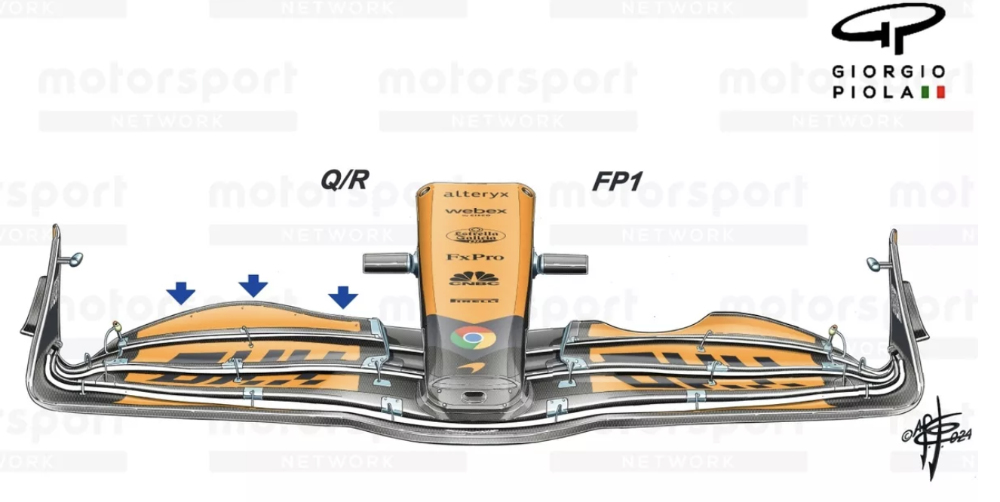

**One Stop vs. Two Stop: How Ferrari Outmaneuvered McLaren at Monza**

*This project was created and written by **Gerry Jones, Jr.*** For inquiries or collaborations connect on [LinkedIn](www.linkedin.com/in/gerry-jones-jr-72b448340)
  

***Table of Contents:***

1. Introduction
2. Race Strategy Breakdown
3. Aerodynamic Upgrades & Impact On Performance
4. Telemtry & Lap Time Analysis
5. Findings & Conclusion 
6. Future Plans
7. References
   
  

**Language:** Python
 
**Libraries:** MatPlotlib, FastF1 & OS
 
**IDE**: Visual Studio Code

**1. Introduction**

This project analyzes the strategic differences between Ferrari and McLaren at the 2024 Italian Grand Prix, focusing on how tyre degradation, telemetry data, and car upgrades influenced the race outcome. By comparing Charles Leclerc’s one-stop strategy to Lando Norris’ two-stop strategy, this analysis explores why Ferrari’s approach was successful despite McLaren’s strong qualifying performance.
    
*While both Ferrari drivers followed the one-stop and both McLaren drivers followed the two-stop, this project specifically focuses on Charles Leclerc (Ferrari) and Lando Norris (McLaren). Even though Norris was not the highest finishing McLaren driver, there were significantly more encounters with him and Leclerc, providing some interesting analysis between the drivers.*
  

**2. Race Strategy Breakdown**

Below is a table breaking down the strategies implemeneted for Leclerc and Norris.

| Team       | Driver  | Strategy  | Pit Stops | Tyre Compounds Used |
|------------|--------|------------|------------|---------------------|
| **Ferrari**| Leclerc|  **One-Stop**|  1  |     Medium → Hard |
| **McLaren**| Norris |  **Two-Stop**|  2  |     Medium → Hard → Hard |

To fully grasp the significance of these differing strategies, let's take a moment to understand the upsides and downsides of each.

**One-Stop**
 
Pros: 
- Prioritizes track position later in the race. By pitting once, a driver can stay out longer while others pit, potentially gaining or maintaining track position towards the end of the race.

Cons:
- Usually requires cautious management of tyre life, thus leading to a compromise in racing pace. Towards later stages of the race, a driver may lose track position due to competitors having fresher tyres. 

**Two-Stop**
Pros:
- Allows for more agressive driving to maximize the pace and grip of fresher tyres. 

Cons:
- The additional pit stop potentially means losing track position to cars that are on a one-stop strategy or pit in a more optimal window.

**Summary Of Key Events**

*First Pit Stop Window:*

   - On Lap 14, Norris made his first pit stop, switching to the hard tyre compound, aiming to maintain pace while extending his stint.
   - Ferrari responded by pitting Leclerc on Lap 15, mirroring Norris' strategy to cover the undercut.

     
*Mid-Race Phase & Second Pit Stop:*

   - By Lap 31, Norris was experiencing significant front tyre degradation, particularly into Monza’s heavy braking zones.
   - Meanwhile, Leclerc, on the same hard tyres but in tyre management mode, was able to maintain competitive pace while extending his stint.
   - On Lap 33, Norris made his second pit stop, switching to a fresh set of hard tyres. In contrast, Leclerc stayed out, committing to the one-stop strategy.
  
     
*Final Stint & Race Outcome:*

   - Norris had stronger pace on fresher tyres in the final stint, but the track position deficit was too large to recover before the checkered flag.
   - Leclerc managed his tyres to the end and secured Ferrari’s home victory, while Norris finished P3 behind teammate Piastri.
  

*Track Layout:*
The circuit at Monza has a reputation of having high-degreation due to long high-speed straights that enter in to slow sharp corners. The dramatic change in speed places significant stress on the tyres, causing them to wear faster than other circuits such as Monaco or Singapore. 
  

  

*Norris:*

In a post-race interview, Lando Norris reflected on McLaren’s strategy, saying "Today we thought of the one-stop. We were ready to try and do a one-stop, we just couldn't achieve it. Our degradation was too high from the front tires." From the start, McLaren was aware that a one-stop strategy would be difficult due to their car’s tendency to struggle with front tyre degradation. Given Monza’s layout, excessive wear on the front tyres was always going to be a challenge. To visualize Norris' two-stop strategy, below is a plot of every lap in the race. The two spikes indicate laps where he entered the pits:

  

As seen in the plot, Norris entered the pit lane on laps 14 and 32.
  

*Leclerc:*

Ferrari's plan was daring given the conditions. As mentioned before, the risk of tyre degredation and drop in performance was a very real threat when executing a one-stop strategy. Concurrently, if Leclerc found himself with good track position, he would run the possibility of needing to defend the lead on worn tyres which is a difficult task. However, in a post-race interview, Leclerc made it clear that Ferrari was not entirely confident in the one-stop strategy in the beginning stages of the race after receiving news that Red Bull was experiencing graining on the hard tyre compound. Nonetheless, Leclerc had a gut feeling that it was the correct play to pressure Norris into pitting. To visualize his one-stop strategy, below is a plot of his lap times through the entire race, once again with the spike indicating when he entered the pit lane on lap 15:

   

Now that we’ve established the key moments of the race and taken generalizations from strategy, it’s important to understand how Ferrari's and McLaren’s car setups influenced their ability to execute these plans. Before diving into telemetry data, we must first look at the aerodynamic upgrades brought to Monza. These upgrades played a crucial role in shaping how each car managed tyre wear, straight-line speed, and overall race pace—ultimately determining whether a one-stop or two-stop strategy was successful.
  

**3. Aerodynamic Package**

Leclerc managed to pull off one of the more daring strategies of the 2024 season and it begged the question: Why was his car able to minimize degredation, yet maintain comparable to McLaren?

**NOTE:** *For all teams, the "ride height" is an implied change each race due to this being a part of the car setup not a physical upgrade. While the ride height does affect the aerodynamics, it is not implemented by physically altering the geometry or shape of the car's body. All quoted statements of the upgrades are from the F1 teams themselves.*

*Below are Ferrari's Monza specific upgrades:*

**Ferrari**
- Front wing: "The depowered front wing flap provides the required aero balance range associated to the optimum downforce level anticipated for Monza. Different trims are available, to allow modulation."

- Rear wing: "This update features depowered Top and Lower Rear Wing profiles in order to adapt to Monza layout peculiarities and efficiency requirements. Both a new design and the carry-over of last year’s geometries (TRW and LRW) will be available."

  

**Front Wing Analysis**

Firstly, like many teams at Monza, Ferrari opted for a low downforce front wing design. As mentioned before, tyre degredation is an important factor in being competitive at such a circuit. Less downforce means there will be less stress on the tyres, especially in high-speed braking zones. Simply put, the car is not "pushed" into the ground as aggressively, thus protecting the tyre life. Below is a photo comparison of the front wing designs from the Belgium Grand Prix (which is a medium downforce circuit) and Italian Grand Prix (which is a low downforce circuit). The highlighted line on the top of the wing edge shows the differing geometric shapes:
  

Photo Courtesy of F1Unchained Youtube Channel
  

While it may seem like there insignificant differences in the front wing, "depowering" the wing by shallowing it reduces the downforce implied on the front of the car. In turn this reduces the stress on the tyres, thus minimizing degredation. This upgrade for Ferrari made it apparent that they were willing to sacrifice more cornering speed at the benefit of preserving their tyres, much like the philosophy of other teams. Concurrently, this helps with straight line speed for the long stragihts. Ferrari also stated that this low downforce setup in the front wing provide the "required aero balance" for the circuit.
  

*What Is Aero Balance?*

Aero balance quantifies how the total downforce is distributed onto the front axle. At a track like Monza, which features high-speed straights and slow chicanes, an optimal aero balance typically shifts more downforce to the rear while maintaining 42-44% of the total downforce on the front axle. A front-heavy aero balance (too much downforce at the front) can cause the rear to become unstable, making it difficult to control through Monza’s chicanes and braking zones. Conversely, an excessive rearward aero balance can induce understeer, making the car sluggish through corners. While Ferrari’s exact aero balance at Monza is unknown, it is reasonable to assume that their front wing adjustments were designed to operate within the optimal 42%-44% range for Monza’s low-downforce characteristics. Below is a visualization showing how front downforce is affected by ride height and front wing angle:

The x-axis represents rear ride height, while the y-axis represents front ride height. The red areas indicate the highest front downforce, while blue areas indicate lower front downforce.

Since lower front downforce is preferred for Monza, teams would in theory, set their ride heights to fall within the blue zones, balancing a slightly higher front ride height with a lower rear ride height to maximize straight-line speed while maintaining cornering stability.

**NOTE:** This aero map is NOT from Ferrari’s car but rather a generalization of aero mapping for a Formula-style race car. Precise team testing data is proprietary and not publicly available, making it impossible to obtain exact aero balance figures for individual F1 teams. However, this generalization can help paint a picture for the nature of car balance.

  

**Rear Wing Analysis**

Ferrari' other main upgrade involved their rear wing, which aimed to further reduce downforce, once again favoring straight line speed and reducing aerodynamic load placed on the tyres. Below is another photo comparison of Ferrari's rear wing design from the 2023 Italian Grand Prix and 2024 Italian Grand Prix:

Photo Courtesy of F1Unchained Youtube Channel

The 2024 iteration of Ferrari’s Monza rear wing featured a less pronounced beam wing, further trimming drag compared to its previous version. While reducing rear wing downforce improves straight-line speed, trimming it too much can cause rear instability, making the car harder to control under braking and through chicanes. However, Ferrari’s engineers carefully balanced the car, ensuring that despite the reduced rear downforce, there was still enough rear stability to allow the front end to operate within the optimal aero balance range (~42-44%). This balance was critical in enabling Ferrari’s one-stop strategy, as it helped manage tyre wear while maximizing top speed. 

In Formula 1, "car balance" refers to the intricate relationship between all components of the car. Every element is interconnected, and they must be precisely tuned to work in harmony for optimal performance. A deeper analysis would well extend beyond the scope of this project and is best explained by an engineer. However, this hopefully illustrates a fraction of the complexity that goes into setting up a Formula 1 car for a specific circuit.

While these two aerodynamic upgrades were not the only reason for Leclcerc winning, it played a crucial role to allow him, as the driver, to execute this devilish one-stop strategy. Driver skill and strategy calls all played a part in Leclerc's victory.
   

*Below are McLaren's Monza spcific upgrades:*

**McLaren Upgrades**

- Front Corner: "To cope with the specific demands of this circuit, the Front Corner geometry has been revised, with the primary aim of increasing Brake Cooling performance while maintaining aerodynamic efficiency."

- Front Wing: "The Front Wing Flap has been redesigned to extend the available aerobalance range, which could be a requirement given the specific circuit layout."

**Front Corner Analysis**

Firstly, it is important to address McLaren's front corner upgrade was implemented for more efficient brake ducts. The front corner is a portion of the front wing that interacts with the air first before passing through into the brake ducts. The primary function of brake ducts is to provide adequate cool air into the braking system to prevent it from overheating. However, brake ducts are not just for maintaining brake temperatures, but play a role in tyre temperature, which in turn contributes to tyre sustainability. As a matter of fact, brake ducts also behave as an aerodynamic element that is responsible for managing airflow to other components of the car. Below is a photo of McLaren's brake duct the weekend of the Italian GP.

With the car fully integrated, the brake duct is partially visible in the encircled region of the below photo:

As stated, brake ducts are important for cooling but are also integral to the aerodynamics of the car by reducing the *"outwash"* effect. Outwash is caused by the front tires generating turbulent air, disrupting the aerodynamics for the rest of the car. Therefore, brake ducts are concurrently designed to control and redirect air towards the floor, sidepods and posterior of the car while still cooling the brakes. Below is a diagram of an older F1 car model, but still showcasing the general premise of brake ducts. The red rectangle highlights where the left front brake duct is located. The red arrows indicate where the air is directed after coming in contact with the brake ducts:

**Front Wing Analysis**

Similar to other teams, the purpose of the front wing upgrade was to reduce drag for straightline speed and less downforce on the front of the car, in theory mitigating front degredation. 

However, there is a critical detail to point out in McLaren's reasoning compared to Ferrari's. Ferrari trimmed their front wing for the "required" aero balance range for Monza. McLaren trimmed their front wing to "extend the available aero balance range." What does this mean? Extending an operational aero balance range means widening the scope of adjustments McLaren make to their aero dynamic package. This statement could've potentially hinted at McLaren having a level of uncertainty for their package at Monza if they needed to widen the range of their aero balance. Given McLaren had been struggling with front tyre degredation throughout the season, it would make sense to widen their flexibility to make changes at a circuit that demands such. However, widening aero balance range can come with potential risks, especially at a circuit such as Monza that require a "narrow" setup. This claim can be further validated given their noticable difference in their front wing design for the practice session at Monza compared to the race. Below is an image comparing the front wing design McLaren used in their first practice session(right) and what was implemented in the race(left). 

Based on publicly available photos of designs, McLaren's front degredation reputation, the nature of the Monza circuit and the engineer's wording in their upgrade reasons, it is realistic that McLaren was not entirely sure what the best balance was for the car for the course of an entire race length. Instead they opted for a package that would bode well in qualifiying, thus solidifying a good track position on the starting grid. Obviously it was not quite enough, but it gives some insight on the constant attention to detail that F1 engineers and mechanics face on a weekly basis.
  

Another potential contributor to McLaren’s struggle with front tire degradation could have been fuel burn dynamics which the aerodynamics is partially dependent on. As fuel burns off, the car’s weight distribution changes (slightly shifting forward), potentially shifting the balance forward and increasing front-end sensitivity. Over a long stint, this can exaggerate front tyre wear if the car is already prone (which it was) to front degradation. Considering F1 cars are slightly rear heavy when fully fueled, this could explain why Norris was barely able to put out faster lap times compared to Leclerc towards the ending stages of the race (we will touch on this in the telemetry data).
   

**4. Lap Time & Telemetry Analysis**

*The Undercut Battle: Norris Pulls the Trigger, Ferrari Responds:*

On lap 14, Leclerc was in P2 and Norris was in P3 by a gap of ~0.87 to ~0.95 seconds. This was confirmed and cross validated from the official broadcast of the race and summing telemetry data from the FastF1 package: 
  

*IMPORTANT CLARIFICATION:*

1. The difference in the intervals can be attributed to the moment at which they were captured. In the photo of Norris entering the pit lane, it shows the last broadcasted interval before a graphical overlay stating "In Pits." Since he is aggressively applying the brakes his interval would be slightly more by time he reaches the white line of the pit lane (which is ~2 meters away. Keep in mind that Leclerc stayed out so he is maintaining full racing pace.

2. The photo from the broadcast says lap 15 despite Norris pitting on his 14th lap. This is because the official lap count is dictated by where the leader is. In the photo we can see that Piastri is in the lead, who is ~4.2 seconds ahead of Norris. This means Piastri has officially began his 15th lap, however Norris is still on his 14th lap until he crosses the starting line (even in the pits).
      

This <1 second interval is crucial to note due to the fact, Norris was inside the *undercut window.* Undercutting is a method of overtaking a car by pitting earlier than them to equip fresher, faster tyres. Once new tyres are applied, the driver attempts a fast out lap with the intention of overtaking the leading car when they are in the pit lane. The premise is by using newer tyres, the initial interval can be *cut* by executing a quicker out lap. The power of undercutting increases on longer circuits since it allows more time to be made up before starting a new lap. Thus the undercut is a useful tactic at a circuit such as Monza. 

As one could imagine, the chance of executing an undercut increases the closer you gets to the car in front. At this particular ciruit, the *undercut window* is ~2.5 seconds at most. Therefore, attempting an undercut outside of this range would more than likely fail. Norris' race engineer informs him "Lando I suggest we box [pit] to overtake on Leclerc". Telling Lando to pit to overtake implies an undercut. Below is a plot of Lando's lap times from the beginning of the race up until this moment on the radio, before his first pit. There is an upward trend starting at lap 10 which indicates a slight drop off in performance. Considering McLaren was expecting to do a two-stop strategy, this very well could've been their anticipation. 

   

Leclerc would pit one lap later, equipping hard compound tyres to begin his long stint to the end of the race. However, the undercut move worked on Leclerc for the time being, with Norris taking P6 and Leclerc P7. It's from this point forward where the one-stop strategy proved effective against the two-stop. 
  

***Closing the Gap: Leclerc’s Chase That Broke McLaren’s Strategy***

On Lap 31, Leclerc's race engineer, Bryan Bozzi, informed him: "Norris is starting to struggle. This is when Red Bull began experiencing graining around Lap 15 of their stint." At the same time, Norris was losing grip at the second chicane, a high-speed braking zone where front tyre wear is critical. As previously mentioned, Leclerc had been closing the gap to Norris, effectively "pressuring" McLaren into making the strategic call to pit him early. By Lap 31, Leclerc was within 0.5 seconds of Norris, while Norris was experiencing a significant loss of performance due to tyre wear. This deterioration ultimately forced McLaren to bring Norris in for his second pit stop. 

Below is an image from the broadcast highlighting the interval Leclerc was able to create, which played a crucial role in influencing McLaren’s decision

To visualize the difference in performance, below is a trace of Norris' telemetry on lap 31 (when he started to struggle) and lap 16 (when his tyres were young). The area enclosed in the red box indicate where he lost substantial grip at the second chicane.

  

At the peaks of his telemetry trace, his top end speeds were not suffering as much as his corners, which is when front grip matters most. Having lost stability from the worn tyres, Norris came to the pits on lap 32 for a fresh set of hards. 
   

*Leclerc's Daunting Hard Tyre Stint*

Now it is time to take a look at Leclerc and how his lap pace held up during this long stint on the hard tyres. Below is a telemtry trace of Leclerc, on lap 39, after retaking the lead compared to his fastest lap of the race. It is incredibly impressive to see the pace he was able to maintain while managing worn tires. At this point in the stint, he was in the duration threshold where Ferrari witnessed Red Bull's hard compound degrading. Leclerc managed to sustain competitive lap times with minimal signs of degradation. This is truly a testiment to Leclerc's skill as a driver but also warrants analysis into other reasons as to why he was able to do this. As seen in the trace below, Lecerc's minimal degredation allowed him to execute *consistent* lap times although they were not the fastest:
  

  

**Comparing Leclerc's & Norris' Telemetry**

Taking a look at both Leclerc and Norris on lap 32 (just before Norris Pitted), we can see the result of Leclerc being able to maintain the life in his tyres, and Norris struggling to push. We can see Norris' corner exits are less consistent compared to Leclerc which can be attributed to the car becoming less responsive on the degraded tyes. Hence, this is why McLaren called him into the pits for fresh hard tyres:

NOTE: The drop off in Norris' telemetry at the end of the plot is due to him entering the pit lane.

**5. Findings & Conclusion**

Both Ferrari and McLaren arrived at Monza facing a similar challenge: optimizing their car for low downforce while minimizing tyre degradation. Ferrari’s one-stop strategy proved to be the right call, executed with precision by Leclerc, and complemented by a well-balanced car. These factors came together to produce one of the most exciting races of the 2024 season. In conjunction to this, Leclerc simply managed to consistently maintain a pace that kept him ahead long enough. It's important to note that McLaren technically had a faster car than Ferrari at the Italian Grand Prix. However, their setup was unable to sustain that pace compared to Ferrari, keeping them at arms length. This highlights how simply having the fastest car in Formula 1 is not always enough to win. Instead of *fast enough* car that is consistent is enough to win.

Norris later admitted in a post-race interview: "Ferrari did something with strategy we would not have been able to achieve today." McLaren would also concede that they were inaccurate with the window in which they pitted their cars. As mentioned before, these pit stop errors were partially induced by Ferrari pressuring McLaren. While McLaren’s inability to fully solve their tyre wear problem cost them at Monza, their overall performance remained strong throughout the season. In the end, McLaren would go on to win the 2024 Constructors' Championship, proving their long-term development and race execution were consistently strong.

**6. Future Plans**

This project serves as a stepping stone for a larger iteration of the 2024 Italian Grand Prix, with the next phase focusing on AI-driven race strategy simulations. Currently, I am developing an AI model designed to answer post-race "what if" questions—a common discussion point in Formula 1. This model will be trained on historical F1 track and car telemetry data, enabling it to simulate different race scenarios based on real-world conditions. The goal is to create a tool that can:

- Simulate alternative race strategies to assess whether a different approach could have changed the outcome.
- Predict the effectiveness of pre-race strategies, helping to evaluate the merit of different pit stop and tyre management plans.
- Provide data-driven insights for fans and analysts looking to explore how variables like Safety Cars, tyre degradation, or pit timing impact race results.
  
This AI model will serve as both a post-race analysis tool and a pre-race strategy tester, offering a deeper, data-backed perspective on race decisions.

**7. References**

1. **Race Highlioghts | 2024 Italian Grand Prix** - *Formula 1 YouTube Channel* 
   - [Link](https://www.youtube.com/watch?v=sTmpbEYUba0)

2. **Lando Norris Post Race Interview - REACTION on P3 - Italian Grand Prix 2024** - *MK TV YouTube Channel*
   - [Link](https://www.youtube.com/watch?v=pjKxnyrQ_Ag)
  
3. **Charles Leclerc Post Race Interview - REACTION ON WIN - Italian Grand Prix 2024** - *MK TV YouTube Channel*
   - [Link](https://www.youtube.com/watch?v=X4hAhDtIIgc)

4. **What Every F1 Team Has Upgraded Or Brought For The Monza GP** - *F1Unchained YouTube Channel*
   - [Link](https://www.youtube.com/watch?v=O22h1oq4ac0&t=544s)

5. **Official Car Presentations For 2024 Italian Grand Prix** - *FIA*
   - [Link](https://www.motorone.gr/wp-content/uploads/2024/08/2024-Italian-Grand-Prix-Car-Presentation-Submissions.pdf)

6. **Front Wing of an F1 Car: How to Optimize Its Design** - *SimScale* (2024)
   - [Link](https://www.simscale.com/blog/front-wing-f1-car-optimize/)
  
7. **FIA declares all 2024 wings legal after clarification sought on McLaren, Mercedes designs** - *AutoSport* (2024)
   - [Link](https://www.autosport.com/f1/news/fia-declares-all-2024-wings-legal-after-clarification-sought-on-mclaren-mercedes-designs/10650881/)
  
8. **What Is AN Aero Map?** - *Racecar Engineering* (2019)
   - [Link](https://www.racecar-engineering.com/tech-explained/what-is-an-aero-map/)
  
9. **THE SUBTLE MCLAREN UPGRADES THAT HIGHLIGHT ITS F1 TITLE FOCUS** - *MotorSport* (2024)
    - [Link](https://www.motorsport.com/f1/news/the-subtle-mclaren-upgrades-that-highlight-its-f1-title-focus/10649555/)

**Acknowledgement:** I'd like to thank Casper Guo who created the FastF1 Python Package. This package is streamline and extremely simple to leverage as seen in the below screenshot:

FastF1 made it possible to fetch any lap and telemetry data inside of Python and conduct analysis. I plan utilizing this for future projects. Below is a link to Casper's GitHub to support his work!

https://github.com/theOehrly/Fast-F1
  

