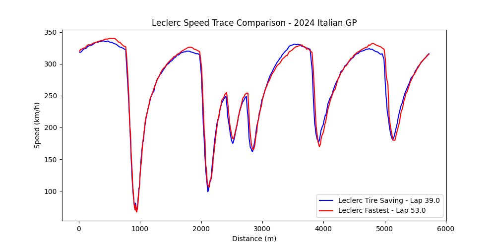

One-Stop VS Two-Stop Strategy

*Table of Contents:*

1. Introduction
2. Race Strategy Breakdown
    - Pit Summary
    - Tire Strategy
3. Telemetry & Lap Time Analysis
4. Tire Management & Degredation
5. Impact of Car Upgrades
6. Findings & Conclusion
7. Future Work
8. References

1. Introduction

At the **2024 Italian Grand Prix**, Ferrari and McClaren took two different approaches:
    - Ferrari opted for a one-stop strategy, maximizing track position at the expense of staying on older tires.
    - McClaren opted for a two-stop strategy, prioritizing racing pace at the expense of pitting an additional time.

What this project analyses:
- Which strategy was more effective and why
- Telemetry differences between Leclerc and Norris
- How tire degredation and car upgrades influenced the race outcome

Charles Leclerc went on to win the 2024  Italian Grand Prix, deploying Ferrari's one-stop strategy while Lando Norris finished P3, behind his teammate Oscar Piastri. This projects aims to reveal smaller details that contributed to Leclerc coming out on top despite Lando Norris having solid qualfying pace.

2. Race Strategy Breakdown

| Team       | Driver  | Strategy  | Pit Stops | Tire Compounds Used |
|------------|--------|------------|------------|---------------------|
| **Ferrari**| Leclerc|  **One-Stop**|  1  |     Medium → Hard |
| **McLaren**| Norris |  **Two-Stop**|  2  |     Medium → Hard → Soft |

Before analyzing the differing strategies it is important to state the pros and cons of each.

*One-Stop*
Pros: 
- Improve track position later in a stint. By pitting once, a team plays the long game of staying out on track when teams decide to pit later. This is ultimately in hopes of maintaining track position long enough until the ending stages of the race.

Cons:
- By only pitting once, it typically involves a compromise in racing pace. While it is benefitional to have stayed on track longer, for position, it requires less agressive driving to preserve the life of the tires. In the end, if executed poorly, the depleted tires could result in a loss of track position by cars with fresher tires.

*Two-Stop*
Pros:
- An imporovement in racing pace, allowing the driver to driver with a more aggressive style to maximize the life of the tires.

Cons:
- A potential loss in track position due to the extra pit. 

The circuit at Monza has a reputation of being a "low-degreation circuit" which favors the strategy of pitting once. However, this is in theory and many more factors come into play to successfully execute a one-stop strategy. McClaren did well in qualifying, capturing a front row spot on the grid at P1 and P2. Ferrari was not far behind with Leclerc starting P3 and Sainz starting P5. With McClaren showcasing good pace in qualifying, people were eager to see how their two-stop strategy would play out. 

In a post-race interview, Lando Norris stated, "Today we thought of the one-stop. We were ready to try and do a one-stop, we just couldn't achieve it. Our degradation  was too high from the front tires." Therefore, going into the race, the McClaren F1 team was aware that they would most likely need to execute a two-stop strategy and acted accordingly. They tried to make the best of the most realistic strategy at their disposal. McClaren throughout the 2024 had struggled with front tire degredation, which is particularly more detrimental at a circuit such as Monza. Due to Monza having high-speed braking zones, coming out of long straights, more load is placed on the front tires as the car enters and exits the corner. Over the course of the race this means the driver is not able to agressively brake into corners, the more the front tires wear. Hence, this is why McClaren was fairly certain in the necessity of implementing a two-stop strategy at Monza. This ultimately resulted in Norris compromising his track position. Below is a graph of Lando's laptimes over the race. The spikes in laptimes indicate the driver entering the pitlane since the lap time still runs in the pit lane:

As seen in the plot, Norris entered the pit lane on laps 14 and 32.

On the other hand Ferrari's plan was seen as high-risk high-reward. As mentioned before, in the pros and cons of one-stop strategies, the risk of tire degredation and drop in performance was a very real threat. Concurrently, in the event one finds themselves with good track position, they run the risk of needign to deend their position on worn tires which is an extremely difficult task. Charles Leclerc in a post-race interview made it clear that Ferrari was not entirely confident in the one-stop strategy in the beginning stages of the race after hearing that Red Bull was experiencing graining on the hard tire compound. However Leclerc had a gut feeling that it was the right play, "However, when I  put it on I had quite a good feeling. I just  wanted to put Lando under pressure and he pitted in front of me. Then I managed to get back some front  grip whenever he was out the way." Below is a graph of Leclerc's lap times through the entire race, once again with spikes indicating when he entered the pits:

As seen here, Leclerc pitted once on lap 15. It was highlighted above that Leclerc "pressured" Norris into pitting. On lap 14 (when Norris pitted), Leclerc was in P2 and Norris was in P3 by a gap of ~0.87 to ~0.95 seconds. This was confirmed and cross validated from the official broadcast of the race and summing data from the FastF1 API: 

IMPORTANT CLARIFICATION: 

1. The difference in the intervals can be attributed to the moment at which they were captured. In the photo of Norris entering the pit lane, it shows the last public broadcast interval before a graphical overlay stating "In Pits." Since he is aggressively applying the brakes his interval would be slightly more by time he reaches the white line of the pit lane (which is ~2 meters away. Keep in mind that Leclerc stayed out so he is maintaining full racing pace.

2. The photo from the broadcast says lap 15 despite Norris pitting on his 14th lap. This is because the official lap count is dictated by where the leader is. In the photo we can see that Piastri is in the lead, who is ~4.2 seconds ahead of Norris. This means Piastri has officially began his 15th lap, however Norris is still on his 14th lap until he crosses the starting line (even in the pits).

This 4.2 second interval is crucial to note due to the fact Norris is inside the "undercut window." An undercut window is an optimal time interval to be within the car in front, to pit a lap earlier for fresh tires. Once new tires are applied, the driver attempts a fast out lap with the intention of overtaking the leading car when they eventually pit. At this particular ciruit, the undercut window is about seconds to 2.5 seconds at most. McClaren had Norris pit in an effort to "overtake Leclerc" as said by his racing engineer.

Based on lap data, Norris began experiencing the effects of tire degredation around lap 10 as seen in the following plot.

From laps 10 until 13 it is clear that his times were progressively getting worse before eventually pitting for the hard tire compound.

Leclerc would pit on lap 15, equipping hard compound tires to begin his long stint to the end of the race. However, the undercut move worked on Leclerc for the time being, with Norris taking P6 and Leclerc P7. Just as important, it's from this point forward where the one-stop strategy proved effective against the two-stop strategy. 

On lap 31, Leclerc's racing engineer informs him, "Norris starting to struggle, this is when Red Bull started to have graining, around lap 15 of the stint." He is referring to Red Bull starting the race on hard tires and experiencing degredation around the 15th lap of the stint. Concurrently, Norris would lose grip at the second chicane which is a high-speed braking zone. Below is a plot of his telemetry on lap 31 (when he started to struggle) and lap 53 (his fastest lap of the race). The areas enclosed in the red boxes indicate portions of the lap where he lost significant performance, particularly accelerating out of corners which require consistent grip:

As seen in the telemetry trace, Norris struggled significantly in the corners, having to settle for slower entry and exit speeds. The image below is a diagram of the the circuit, highlighting the specific corner where he couldn't make the corner due to the lack of grip.

Having lost time from the worn tires Norris came to the pits on lap 33 for a fresh set of hard compound tires. Leclerc in the meantime was managing his hard tires well, moving into P1 while McClaren pitted their other driver that was also on a two-stop strategy.

Now it is time to take a look at Leclerc and how his lap paced held up during this long stint on the hard tires. Below is a telemtry trace of Leclerc's lap after retaking the lead compared to his fastest lap of the race. It is incredibly impressive to see the pace he was able to maintain while managing worn tires. There are corners where Leclerc accelerated out quicker than his fastest lap of the race. This is truly a testiment to Leclerc's skill as a driver but also warrants praise for the engineers that set the car up for that particular weekend:

Leclerc would go on to maintain his lead on the battered hard tire compounds and win the Italian Grand Prix. The one-stop strategy at Monza is very risky, requiring surgical precision by the driver executing the stints, and the engineers properly tuning the car for the circuit. 

3. Aerodynamic Upgrades (Ferrar vs McLaren)

Ferrari and McLaren brought upgrades to their cars the week of the Italian Grand Prix. With how minimal the margins are in Formula 1, the setup of the car can make the difference in winning or losing. Both teams provided official receipts to the FIA of the upgrades they were bringing to the Italian Grand Prix. This can provide valuable insights on what teams prioritize for performance at a circuit. Both teams brought many upgrades but only specific ones were intended specifically for the Monza circuit, as stated by the teams.

Below are Ferrari's Monza specific upgrades:

*Ferrari*
- Front wing: "The depowered front wing flap provides the required aero balance range associated to the optimum downforce level anticipated for Monza. Different trims are available, to allow modulation."

- Rear wing: "This update features depowered Top and Lower Rear Wing profiles in order to adapt to Monza layout peculiarities and efficiency requirements. Both a new design and the carry-over of last year’s geometries (TRW and LRW) will be available."

- 

